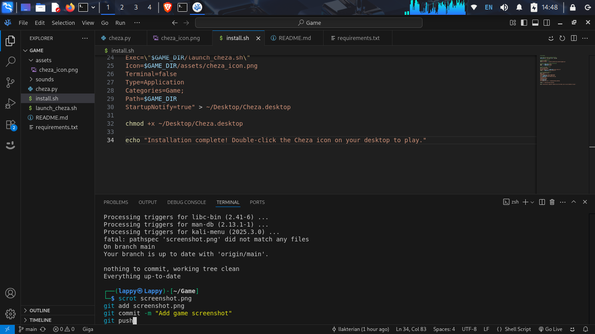

# Cheza - Dynamic Tetris Game



## New Resizing Features
- **Dynamic Board Scaling**: The game board automatically adjusts to your window size
- **Responsive UI**: All elements reposition intelligently
- **Size Constraints**: 
  - Minimum block size: 20px
  - Maximum block size: 50px
  - Default size: 30px

## Controls
- **Arrow Keys**: Move pieces
- **P**: Pause/Resume
- **R**: Restart game
- **Resize**: Drag window edges to adjust game size

## Installation
```bash
# Install dependencies
./install.sh

# Run the game
./launch_cheza.sh